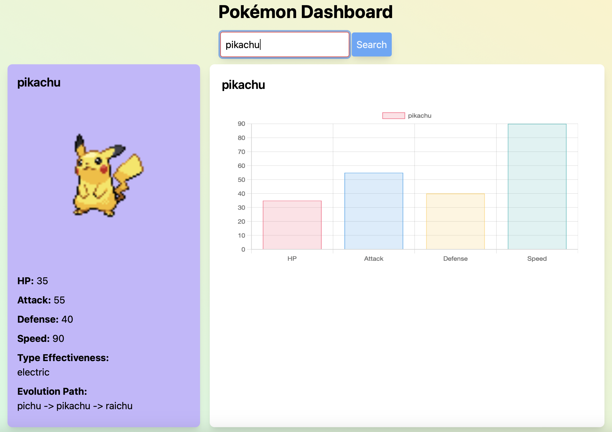

# Pokemon Dashboard:

Welcome to the Pokémon Dashboard! This project allows users to search for a Pokémon and display detailed information about it, including stats, type effectiveness, and evolution paths.

## Technologies Used:
 - [Node.js (v20.15.0)](https://www.npmjs.com)
 - [Npm (v10.7.0)](https://www.npmjs.com)
 - [Axois](https://www.npmjs.com/package/axios)
 - [Tailwind.css](https://tailwindcss.com)
 - [Express](https://www.npmjs.com/package/express)
 - [Charts.js](https://www.chartjs.org)
 - [jQuery](https://jquery.com)
 - [PokéAPI (v2)](https://pokeapi.co/)

## About This Project:

The Pokémon Dashboard is a web application that fetches data from the Pokémon API and displays it in a user-friendly interface. Users can search for any Pokémon by name and view detailed information, including its stats (HP, Attack, Defense, Speed), types, and evolution path.
## Usage:

    1. Enter the name of a Pokémon in the search bar.
    2. Click the "Search" button.
    3. The dashboard will display the Pokémon's stats, types, and evolution path.
    4. View the Pokémon's stats in a dynamic bar chart.
## Features:

- Search Functionality: Users can search for any Pokémon by name.
- Detailed Stats Display: The dashboard displays key stats such as HP, Attack, Defense, and Speed.
- Type Effectiveness: Shows the types associated with the Pokémon.
- Evolution Path: Displays the full evolution chain of the Pokémon.
- Dynamic Charts: A bar chart visualizes the Pokémon's stats.
## Running the Pokémon Dashboard with PM2:

-   git clone: https://github.com/abdule18/Pokemon-node-js.git
- cd Pokemon-node-js

- npm install
- npm install pm2 -g
- pm2 start server.js --name "pokemon-dashboard"
- Access the Pokémon Dashboard: http://localhost:3000
## Running the Pokémon Dashboard Locally with Node.js:

-   git clone: https://github.com/abdule18/Pokemon-node-js.git
- cd Pokemon-node-js

- npm install
- node server.js
- Access the Pokémon Dashboard: http://localhost:3000

